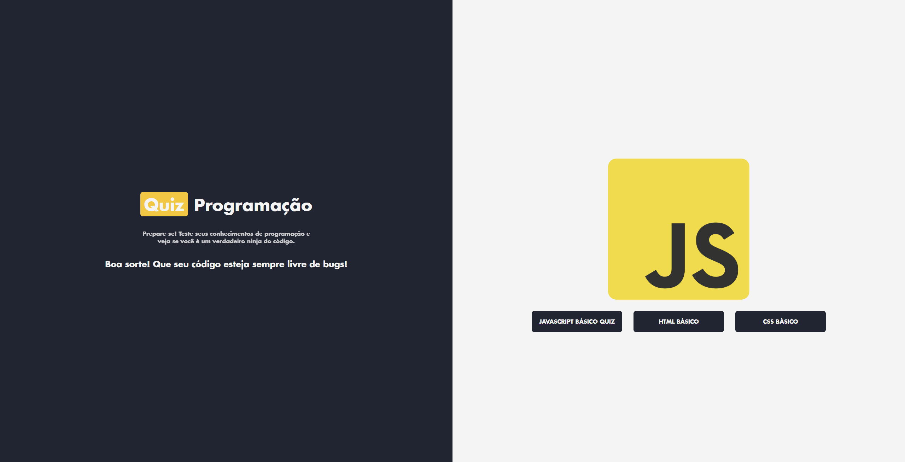
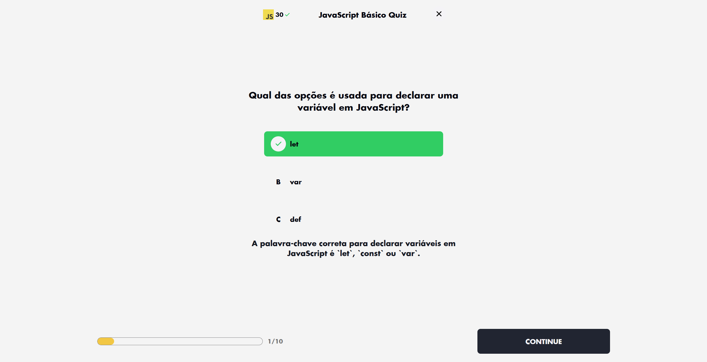
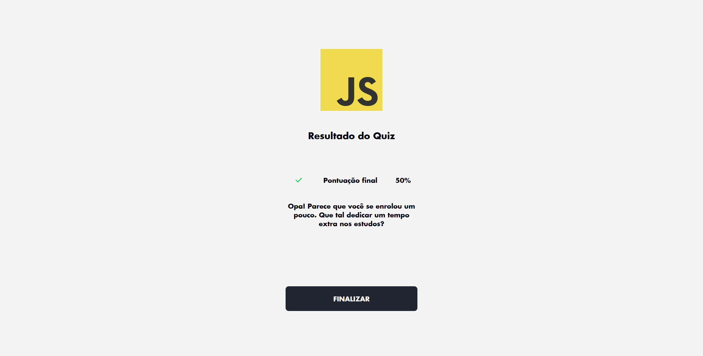

# Quiz App

Este é um aplicativo de quiz interativo desenvolvido com React. Ele permite que os usuários testem seus conhecimentos em diferentes tópicos, como JavaScript, HTML e CSS, respondendo a perguntas de múltipla escolha.

<p align="center">
  
  
  
</p>

## Funcionalidades

- **Página Inicial**: Exibe uma lista de quizzes disponíveis para o usuário selecionar.
- **Perguntas do Quiz**: Apresenta perguntas de múltipla escolha com feedback imediato sobre a resposta correta ou incorreta.
- **Resultado Final**: Mostra a pontuação final do usuário e uma mensagem personalizada com base no desempenho.
- **Criação de Quiz**: Permite criar novos quizzes com perguntas personalizadas.

## Tecnologias Utilizadas

- **React**: Biblioteca principal para construção da interface.
- **React Router**: Gerenciamento de rotas para navegação entre páginas.
- **Styled Components**: Estilização dos componentes com CSS-in-JS.
- **React Hook Form**: Gerenciamento de formulários para criação de quizzes.
- **JSON**: Armazenamento das perguntas e respostas dos quizzes.

## Estrutura do Projeto

```
quiz-app/
├── public/
│   ├── index.html
│   ├── manifest.json
│   └── assets/
├── src/
│   ├── assets/
│   ├── components/
│   │   ├── App/
│   │   ├── Button/
│   │   ├── NewQuestionForm/
│   │   ├── QuestionOptions/
│   │   └── StatusBar/
│   ├── context/
│   │   └── QuizContext.js
│   ├── design/
│   │   ├── designSystem.js
│   │   ├── images.js
│   │   └── texts.js
│   ├── mocks/
│   │   └── quizQuestions.json
│   ├── screens/
│   │   ├── MainPage/
│   │   ├── Questions/
│   │   ├── Result/
│   │   └── NewQuiz/
│   ├── Routes.js
│   └── index.js
├── package.json
└── README.md
```

## Como Executar o Projeto

1. **Clone o repositório**:
```bash
git clone https://github.com/Wallace027Dev/quiz-app.git
cd quiz-app
```

2. **Instale as dependências**:
```bash
npm install
```

3. **Inicie o servidor de desenvolvimento**:
```bash
npm start
```

O aplicativo estará disponível em http://localhost:3000.

4. **Build para produção**:
```bash
npm run build
```

## Scripts Disponíveis

- `npm start`: Inicia o servidor de desenvolvimento.
- `npm test`: Executa os testes.
- `npm run build`: Gera o build para produção.
- `npm run eject`: Ejetar a configuração padrão do Create React App.

## Estrutura de Dados

Os quizzes são armazenados no arquivo `quizQuestions.json`. Cada quiz contém:

- `id`: Identificador único.
- `name`: Nome do quiz.
- `questions`: Lista de perguntas, cada uma com:
  - `id`: Identificador único da pergunta.
  - `question`: Texto da pergunta.
  - `explication`: Explicação da resposta correta.
  - `answers`: Lista de respostas com `text` e `correct`.

## Contribuição

Contribuições são bem-vindas! Sinta-se à vontade para abrir issues ou enviar pull requests.

## Licença

Este projeto está licenciado sob a MIT License.

---

Desenvolvido por [Wallace Vieira](https://wallacevieira.vercel.app) – Desenvolvedor Fullstack & entusiasta de jogos.